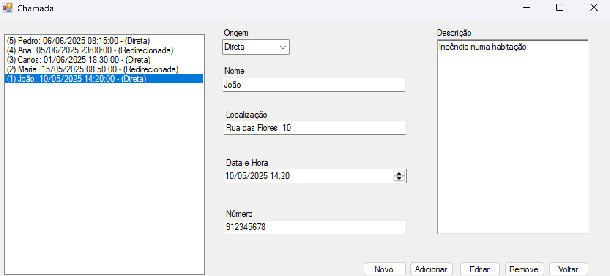
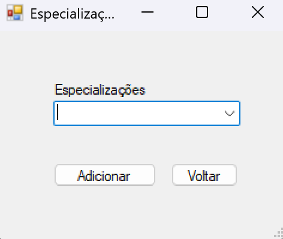

# BD: Trabalho Prático APF-T

**Grupo**: P7G9
- Lázaro Sá, MEC: 115884
- Diogo Soares, MEC: 103521


## Introdução / Introduction
 
A escolha do tema para o nosso projeto surgiu do interesse em compreender melhor o funcionamento de um quartel de bombeiros e os diversos elementos que nele interagem. Este ambiente envolve uma grande responsabilidade e coordenação entre pessoas, equipamentos, viaturas e ocorrências de emergência.

A aplicação desenvolvida tem como objetivo permitir a gestão eficiente de um quartel de bombeiros. Através dela, será possível visualizar e administrar informações sobre os bombeiros, as viaturas disponíveis, as ocorrências registadas e as chamadas de emergência recebidas. Além disso, pretende-se oferecer uma visão integrada das relações entre esses elementos, facilitando o acompanhamento do estado das viaturas, a disponibilidade dos bombeiros (tendo em conta férias e baixas), e o histórico de intervenções em que participaram.

Com este projeto, procuramos não só criar uma ferramenta útil para gestão interna de um quartel, mas também aprofundar os nossos conhecimentos em bases de dados relacionais e sistemas de informação aplicados a contextos reais e críticos como o dos serviços de emergência.

## ​Análise de Requisitos / Requirements
Requisitos Funcionais:
O sistema deve permitir a gestão de informações dos bombeiros, incluindo dados pessoais e associações ao quartel.

Deve ser possível gerir as viaturas do quartel, com seus respetivos tipos e dados como matrícula e ano.

O sistema deve gerir os equipamentos disponíveis, incluindo a sua quantidade e associação a viaturas.

Deve permitir o registo e gestão das ocorrências, associando bombeiros, viaturas e chamadas.

O sistema deve gerir as chamadas recebidas, registando origem, descrição, contacto e localização.

Deve permitir o registo e consulta das férias e baixas dos bombeiros.

O sistema deve gerir as especializações dos bombeiros, possibilitando associar vários bombeiros a várias especializações.

Deve ser possível registar manutenções tanto das viaturas quanto dos equipamentos, com data e descrição.

Requisitos Não Funcionais:
A aplicação deverá ser intuitiva e fácil de usar para facilitar o trabalho dos utilizadores no quartel.

O sistema deve assegurar a integridade dos dados, evitando duplicação e inconsistências.


## DER - Diagrama Entidade Relacionamento/Entity Relationship Diagram

### Versão final/Final version


### APFE 

Desde a primeira entrega, foram feitas algumas melhorias para otimizar o modelo. Adicionámos colunas Identity nas tabelas para facilitar a gestão das chaves primárias e eliminámos a tabela de formações por considerar redundante, simplificando a estrutura. De resto, mantivemos o design inicial, pois acreditamos que estava bem planeado desde o início.

## ER - Esquema Relacional/Relational Schema

### Versão final/Final Version


### APFE

Foi removida a table Formação conforme o DER

## ​SQL DDL - Data Definition Language

[SQL DDL File](sql/01_ddl.sql "SQLFileQuestion")

## SQL DML - Data Manipulation Language

Uma secção por formulário.
A section for each form.

### Formulario exemplo/Example Form


Bombeiro:
 Menu para adicionar, editar e remover bombeiros,
incluindo a gestão das respetivas baixas, especializações e férias.

```sql

-- Mostrar dados no formulário
SELECT * FROM Bombeiro;

-- Inserir novo bombeiro
INSERT INTO Bombeiro (ID_Quartel, Nome_Bombeiro, Data_Nascimento, Morada, Email, NIF, Telemóvel) VALUES
(11111, 'João Silva', '1985-03-15', 'Rua das Flores, 10', 'joao.silva@email.com', '123456789', '912345678');


```


Baixa: Formulário simples para gerir baixas dos bombeiros com datas de início, fim e motivo da baixa.

```sql

-- Mostrar dados no formulário
SELECT * FROM Baixa;

-- Inserir nova baixa
INSERT INTO Baixa (ID_Bombeiro, Data_Inicio, Data_Fim, Razão) VALUES
(1, '2025-06-01', '2025-06-10', 'Lesão durante treino');

```


Chamada: Menu para adicionar, editar ou remover chamadas registando origem, descrição, nome do interlocutor, data/hora e localização.

```sql

-- Mostrar dados no formulário
SELECT * FROM Chamada;

-- Inserir nova chamada
INSERT INTO Chamada (ID_Ocorrência, Origem, Descrição, Nome, Data_Hora_Chamada, Localização, Número) VALUES
(1, 0x01, 'Incêndio numa habitação', 'Maria Santos', '2025-06-05 14:30', 'Rua Central, 23', '912345678');


```


Equipamento: Menu para adicionar, editar e remover equipamentos,
podendo estar associados a viaturas ou apenas ao quartel.
Também permite gerir manutenções do equipamento.

```sql

-- Mostrar dados no formulário
SELECT * FROM Equipamento;

-- Inserir novo equipamento (sem associação a viatura)
INSERT INTO Equipamento (ID_Quartel, ID_Viatura, Nome_Equipamento, Quantidade) VALUES
(11111, NULL, 'Mangueira', 10);

```


Especialização: Formulário simples com combobox para seleção das especializações existentes.

```sql

-- Mostrar dados no formulário
SELECT * FROM Especialização;

-- Inserir nova especialização
INSERT INTO Especialização (Nome_Especialização) VALUES
('Resgate em altura');

```


Férias:
Menu simples para registar períodos de férias,
 com datas de início e fim.

```sql

-- Mostrar dados no formulário
SELECT * FROM Férias;

-- Inserir novo período de férias
INSERT INTO Férias (ID_Bombeiro, Data_Inicio, Data_Fim) VALUES
(1, '2025-07-01', '2025-07-15');

```


Manutenção: Formulário simples para registar manutenções efetuadas,
apenas com data da manutenção e descrição do que foi feito.

```sql

-- Mostrar dados no formulário
SELECT * FROM Manutenção;

-- Inserir nova manutenção
INSERT INTO Manutenção (ID_Viatura, ID_Equipamento, Data_Manutenção, Descrição) VALUES
(1, null, '2025-06-03', 'Troca de pneus e revisão geral');


```


Ocorrência:
Formulário para criar, editar ou remover ocorrências,
associando quartel, data/hora e relacionando bombeiros, viaturas e chamadas.

```sql

-- Mostrar dados no formulário
SELECT * FROM Ocorrência;

-- Inserir nova ocorrência
INSERT INTO Ocorrência (ID_Quartel, Data_Hora) VALUES
(11111, '2025-06-05 14:00');

```


Quartel:
Menu inicial que permite o acesso a todos os outros formulários,
para gerir a informação dos quartéis.

```sql
-- Mostrar dados no formulário
SELECT * FROM Quartel;

-- Inserir novo quartel
INSERT INTO Quartel (ID_Quartel, Nome_Quartel, Endereço, Telefone) VALUES
(11111, 'Quartel Central', 'Avenida Principal, 100', '912345678');


```


Viatura:
Menu para adicionar, editar e remover viaturas,
gerir manutenções e visualizar equipamentos associados.

```sql

-- Mostrar dados no formulário
SELECT * FROM Viatura;

-- Inserir nova viatura
INSERT INTO Viatura (ID_Quartel, ID_TipoViatura, Matricula, Ano) VALUES
(11111, 1, 'AA-11-BB', 2015);

```

...

## Normalização/Normalization

Normalização das tabelas

As entidades foram modeladas em tabelas específicas, cada uma com os seus atributos próprios. Por exemplo, a tabela Especialização contém os tipos de especializações, enquanto a tabela Bombeiro_Especialização é uma tabela associativa que liga bombeiros a especializações, evitando repetir os nomes das especializações em cada bombeiro.

Tabelas associativas (como Bombeiro_Especialização, Bombeiro_Ocorrência e Viatura_Ocorrência) permitem gerir relações muitos-para-muitos sem duplicar informação.

Uso de chaves estrangeiras

As referências (foreign keys) entre tabelas garantem que os dados estão normalizados e que não se repete informação como o nome do quartel ou tipo de viatura dentro de outras tabelas. Isso reduz a redundância e facilita a manutenção da integridade dos dados.

Triggers para integridade e validação

A trigger TRG_Check_NIF_Unico assegura que o NIF é único na tabela Bombeiro, prevenindo duplicações desse dado essencial, que deveria ser único por pessoa.

Outras triggers impedem valores inválidos (ex: quantidade negativa no Equipamento, ano inválido na Viatura) para manter dados coerentes e evitar a inserção de dados errados ou redundantes.

Remoção de tabelas redundantes

A eliminação da tabela extra de formações, mantendo apenas as especializações, foi uma escolha para evitar dados repetidos e complexidade desnecessária no modelo. Isso ajuda a simplificar e compactar o modelo.

Uso de tipos de dados apropriados

Campos como char(9) para NIF e char(12) para telefones limitam o tamanho do armazenamento exatamente ao necessário, economizando espaço.

Índices únicos

Índices únicos em campos como NIF e Matricula garantem que esses dados não são duplicados e melhoram a busca e integridade dos dados.

## Índices/Indexes

Índices para a tabela Bombeiro:
idx_Bombeiro_NIF (único)
Garante que o campo NIF é único na tabela, evitando que dois bombeiros tenham o mesmo NIF. Facilita buscas rápidas por NIF.

idx_Bombeiro_Nome
Índice para o campo Nome_Bombeiro. Melhora o desempenho das pesquisas e ordenações que envolvam nomes dos bombeiros.

idx_Bombeiro_Email
Índice para o campo Email. Otimiza consultas que filtram ou pesquisam bombeiros pelo email.

Índices para a tabela Chamada:
idx_Chamada_DataHora
Índice no campo Data_Hora_Chamada. Acelera consultas que filtram chamadas por data e hora, útil para relatórios temporais.

idx_Chamada_Nome
Índice para o campo Nome da pessoa que fez a chamada. Facilita buscas por nome do interlocutor.

idx_Chamada_Numero
Índice para o campo Número (telefone da pessoa que fez a chamada). Acelera consultas e filtros pelo número de telefone.

Índices para a tabela Equipamento:
idx_Equipamento_Nome
Índice para o campo Nome_Equipamento. Melhora a velocidade de buscas por nome do equipamento.

idx_Equipamento_Viatura
Índice no campo ID_Viatura. Acelera consultas que busquem equipamentos associados a uma viatura específica.

Índices para a tabela Ocorrência:
idx_Ocorrencia_Data
Índice para o campo Data_Hora da ocorrência. Facilita consultas por data e hora da ocorrência, importante para relatórios cronológicos.

idx_Ocorrencia_Quartel
Índice para o campo ID_Quartel. Acelera buscas de ocorrências associadas a um quartel específico.

Índices para a tabela Viatura:
idx_Viatura_Matricula (único)
Índice único para o campo Matricula, garantindo que não haja duas viaturas com a mesma matrícula. Também otimiza pesquisas por matrícula.

idx_Viatura_Tipo
Índice para o campo ID_TipoViatura. Melhora o desempenho em consultas que filtram viaturas por tipo (ligeiro, pesado, etc).

[SQL Indexes File](sql/05_indexes.sql "SQLFileQuestion")

## SQL Programming: Stored Procedures, Triggers, UDF

[SQL SPs and Functions File](sql/02_sp_functions.sql "SQLFileQuestion")

[SQL Triggers File](sql/03_triggers.sql "SQLFileQuestion")

### Dados iniciais da dabase de dados/Database init data

[SQL DB Init File](sql/04_db_init "SQLFileQuestion")

### Apresentação

[Slides](slides.pdf "Sildes")

[Video](https://elearning.ua.pt/pluginfile.php/55992/mod_label/intro/VideoTrabalho2013.mp4)


 